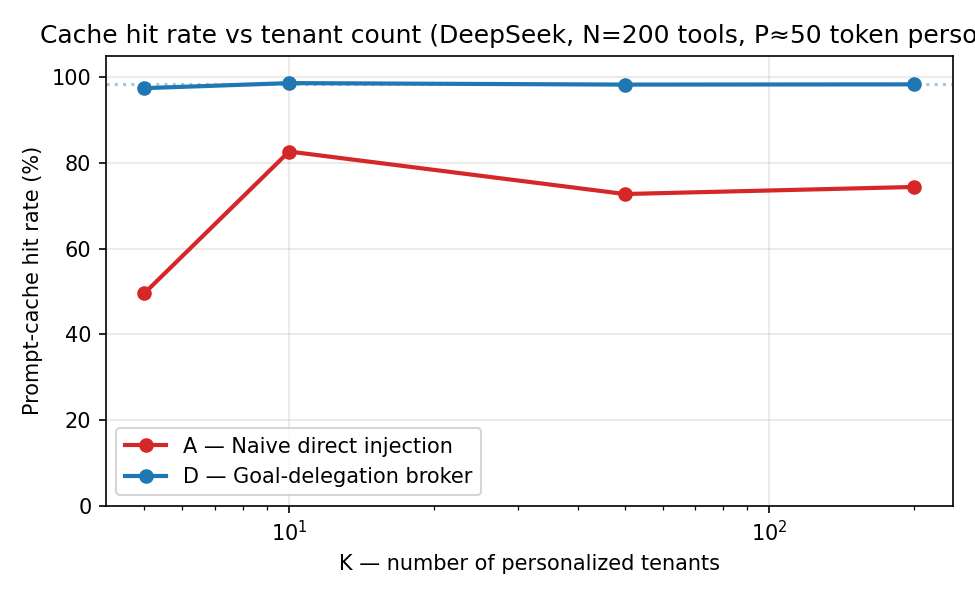
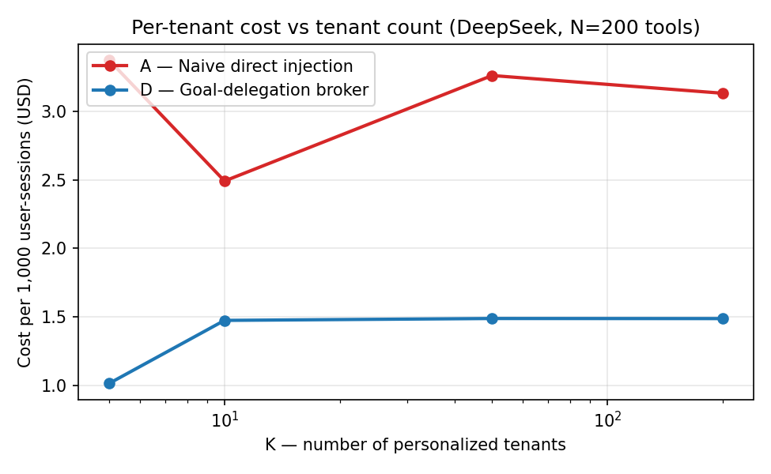
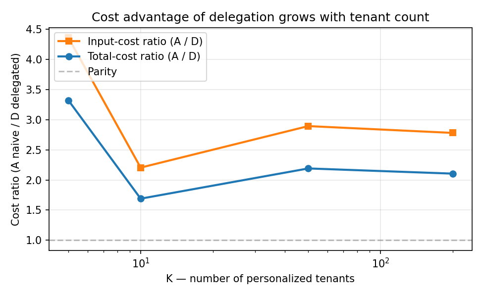
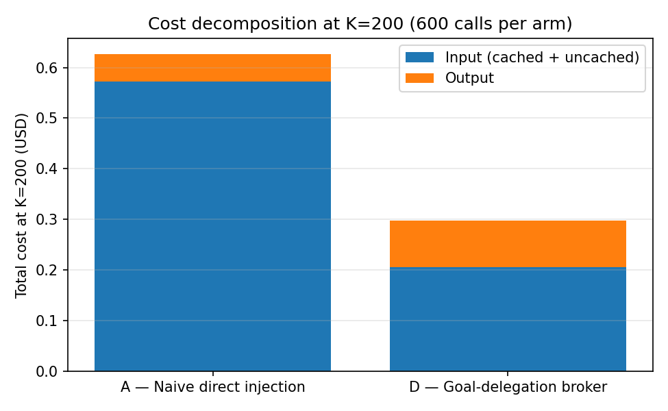
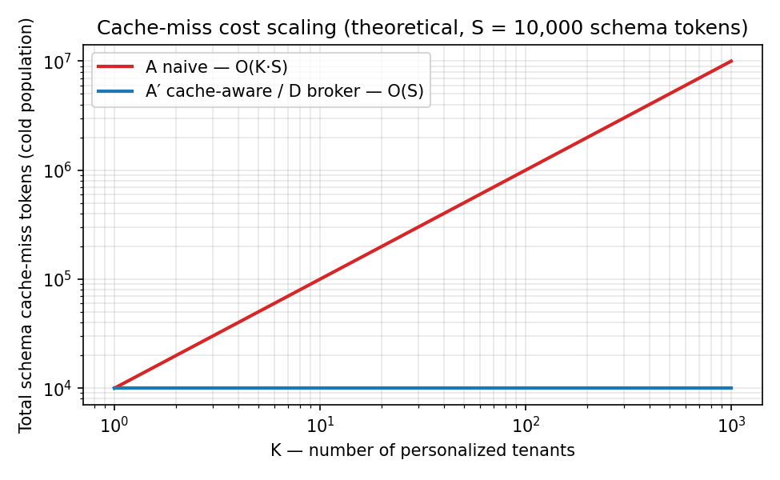

# Cache-Aware Tool Use in Multi-Tenant LLM Systems

**A Cost Model, Cross-Provider Measurement, and Architectural Decision Framework**

Pranab Sarkar, Independent Researcher
ORCID: [0009-0009-8683-1481](https://orcid.org/0009-0009-8683-1481)
Draft v0.3

Keywords: large language models, tool use, prompt caching, multi-tenant systems, capability delegation, cost models, LLM serving

---

## Abstract

Personalized multi-tenant LLM tool use creates avoidable prefix-cache fragmentation when tenant-specific context precedes large stable tool schemas. We formalize this fragmentation pattern, derive a closed-form cost model parameterized by tenant count K, schema size S, personalization size P, cached-token discount α, tool-use rate q, and per-tenant catalog overlap μ, and empirically compare six tool-serialization architectures: naive direct injection (A), cache-aware direct injection (A′), provider-native tool APIs (A_native), top-m schema retrieval (B), goal-delegation broker (D), and broker with internal retrieval (D_rag). Preliminary measurements on DeepSeek with K ∈ {5, 10, 50, 200} personalized tenants over 200 tools and 3 sequential calls per tenant show that delegation maintains a 98.4% prompt-cache hit rate independent of K, while naive direct injection plateaus at 74% hit rate and incurs a 2.10× higher total cost at K=200. We further argue, via the cost model, that under per-tenant tool subsets — the common real-world case in multi-tenant SaaS — cache-aware direct injection cannot preserve O(1) cache geometry in tenant count, while goal-delegation with a unified broker catalog plus runtime ACL can. We provide a cross-provider cache-behavior taxonomy comparing Anthropic, OpenAI, DeepSeek, and self-hosted vLLM, and a decision framework mapping deployment characteristics to recommended architecture. Seven falsifiability conditions are pre-registered. This work extends the substrate-thesis introduced in *Skill as Memory, Not Document* (Sarkar 2026), applying the principle from skills (database-resident) to tool schemas (cache-resident or broker-resident).

---

## 1. Introduction

Production LLM assistants increasingly serve multi-tenant workloads in which each user receives a personalized prompt prefix — a name, role, tenant identifier, communication-style hint, or recent state summary — followed by a tool catalog of tens to hundreds of function schemas. A naive serialization places personalization first and tool schemas afterward:

```
[persona_i]  [stable instructions]  [tool schemas S]  [user query]
```

This is the default emitted by most agent frameworks. It is also a cache hazard.

Modern LLM APIs serve requests through prefix-cache layers (Kwon et al. 2023; SGLang; provider-native caches from Anthropic, OpenAI, and DeepSeek). The cache matches the longest common prefix of incoming requests against previously-seen prefixes. Personalization at position 0 invalidates the prefix at position 0, so the tool-schema block — which often dominates request token count — never reaches the cache across users. Each tenant pays the full schema serialization cost on each cold session. The fix appears trivial: reorder the prompt so the stable schema block precedes personalization. We call this cache-aware direct injection (A′). For homogeneous tool catalogs, A′ closes the gap.

The fix is not always available. In multi-tenant SaaS systems, **the tool catalog itself is frequently tenant-variable** — different tenants subscribe to different integrations, different users hold different authorization scopes, and per-tenant ACL filtering changes which tool schemas appear in any given prompt. Under per-tenant subsets, A′'s cacheable prefix itself becomes a function of tenant identity, and the cache fragments again.

This paper makes four contributions:

1. **Cost model (Section 3).** A closed-form derivation of schema cache-miss cost as a function of architecture, tenant count, personalization size, and catalog overlap. The dominant asymptotic distinction is O(K·S) for naive serialization versus O(S) for any architecture placing tenant-invariant schemas in the cacheable prefix.
2. **Architectural analysis (Section 4 and Section 7).** A framework comparing six tool-serialization architectures, with a decision framework mapping deployment conditions to recommended architecture. The architectural contribution is that **goal-delegation with a unified broker catalog plus runtime ACL is the only architecture preserving O(1)-in-tenants cache geometry under heterogeneous catalogs.**
3. **Empirical validation (Section 6).** Multi-tenant measurements on DeepSeek across K ∈ {5, 10, 50, 200}: delegation holds 98.4% prompt-cache hit rate at every K; naive direct injection plateaus at 74% hit rate; the cost ratio reaches 2.10× total / 2.78× input at K=200, with delegation cost staying constant ($1.49/1k-users) across K while naive cost grows to $3.13/1k-users.
4. **Cross-provider cache taxonomy (Section 5).** A practical reference for prompt-cache behavior across Anthropic, OpenAI, DeepSeek, and self-hosted vLLM, covering TTL, scoping granularity, discount α, native-tool-API serialization position, and cache-hit observability. Cross-provider replication is in progress; DeepSeek results are reported here and Anthropic/OpenAI/vLLM measurements are the subject of an ongoing replication study.

The paper is positioned as the second installment in a substrate-thesis research program initiated by *Skill as Memory, Not Document* (Sarkar 2026). Both papers argue that agent-consumed artifacts — skill bodies in Paper 1, tool schemas here — should be served from substrate (database or shared cache) rather than re-injected per request. The mechanism and the achievable cost reduction differ across artifact constraints; the principle does not.

---

## 2. Background

### 2.1 Prefix caching in LLM serving

LLM serving systems amortize the cost of repeated prompt prefixes by caching the prefill computation. vLLM (Kwon et al. 2023) and SGLang's RadixAttention (Zheng et al. 2024) implement prefix-cache at the KV-cache layer in open-source serving stacks. Provider-managed equivalents include Anthropic's explicit `cache_control` breakpoints (5-minute default TTL, extended cache option), OpenAI's automatic prefix caching for prompts ≥ 1024 tokens, and DeepSeek's context caching with 64-token granularity and multi-hour TTL.

Across implementations, three properties are common: (i) cache matches against the *longest common prefix* of incoming requests; (ii) cached tokens are billed at a fraction α of uncached input cost, with α typically between 0.1 and 0.5; (iii) cache scope is at least per-account, often per-organization, sometimes per-API-key. Cache-hit observability varies: DeepSeek reports `prompt_cache_hit_tokens` and `prompt_cache_miss_tokens` directly; OpenAI exposes `prompt_tokens_details.cached_tokens`; Anthropic returns `cache_read_input_tokens` and `cache_creation_input_tokens`. We summarize provider behavior in Section 5.

### 2.2 LLM tool serialization

Modern LLM APIs accept tool schemas through one of two patterns: a dedicated `tools=` request parameter (Anthropic, OpenAI, DeepSeek's OpenAI-compatible endpoint), or manual JSON injection into the system prompt. Internally, both patterns ultimately materialize schemas in the model's input context — provider-native tool parameters are templated into the prompt at a provider-determined position. Whether this position falls inside or outside the cacheable prefix is provider-dependent and rarely documented; we measure it in Section 5.

### 2.3 MCP and tool transport

The Model Context Protocol (MCP; Anthropic 2024) standardizes tool discovery, schema description, and invocation transport between agents and external systems. MCP servers maintain tool catalogs and execute calls but **do not influence how schemas are serialized into model context.** Schemas are still emitted to the LLM per-request by the agent's prompt construction layer. MCP and cache-aware serialization are orthogonal layers; this paper studies the latter.

### 2.4 The substrate-thesis ancestor

Sarkar (2026), *Skill as Memory, Not Document*, demonstrated that agent skills — descriptive metadata for behavior recipes — should be stored in a database-native substrate rather than as file catalogs. Paper 1's measurements: at 5,000 skills, the file-catalog approach injects 919,200 tokens per agent context; the substrate approach issues a database query returning 369 tokens (constant in catalog size); median retrieval latency 87.3ms; and validator strictness rises from 3% admission of malformed entries to 0%.

The thesis: *agent-consumed artifacts should live in a queryable substrate and be retrieved only when needed, not re-emitted into context.* Paper 1's mechanism is database-native storage; the artifact (skill body) need never appear in the LLM context until it is matched and pulled.

This paper applies the same thesis to a different artifact class. Tool schemas, unlike skills, must appear in the LLM context to be actionable — the LLM cannot call a tool whose existence it does not see. The substrate analog therefore cannot remove schemas from context entirely; instead it must arrange for the schema region of the prompt to be *shared* across requests via the prefix cache. The mechanism is either cache-aware prompt structure or delegation to a broker whose context-shape is tenant-invariant. The achievable cost reduction is bounded by the cache discount α rather than by full removal, hence smaller in magnitude than Paper 1's reduction — a structural ceiling we analyze in Section 11.

### 2.5 Object-capability theory

The notion of capability — a transferable, revocable, runtime-checked authority to invoke an operation — is well-developed in operating-systems and programming-language research (E language; Genode OS; principle of least authority). The broker-mediated architecture in this paper inherits the capability pattern: the broker holds the schema catalog as a runtime registry; ACL filtering enforces per-tenant authorization at dispatch time; the primary LLM never receives capabilities it cannot legitimately invoke. We position the contribution as a translation of capability-system mechanics into LLM-systems engineering, with the added constraint that capability metadata must be cacheable across requests to remain economically viable.

---

## 3. Cost Model

### 3.1 Parameters

Let:

- `K` — number of distinct personalized tenants.
- `S` — tool-schema token count (assume uniform per request).
- `P` — personalization token count per tenant (assume uniform).
- `H` — average conversation-history token count.
- `Q` — average user-query token count.
- `α ∈ [0, 1]` — cached-token price multiplier (cache-hit price ÷ cache-miss price).
- `μ ∈ [0, 1]` — inter-tenant tool-catalog overlap (fraction of schema tokens shared across any two tenants).
- `q ∈ [0, 1]` — fraction of agent turns requiring a tool call.
- `c_in`, `c_out` — input and output token prices (uncached input).
- `o_R`, `o_B` — output tokens emitted by the reasoner and broker respectively in arm D.
- `τ` — cache TTL.
- `λ` — per-tenant request arrival rate.

### 3.2 Architectures and their cacheable prefixes

The six architectures evaluated in this paper differ in the order and locus of their cacheable content. Section 4 describes each in detail; we summarize the prefix structure here:

| Arm | Cacheable prefix | Tenant-variable region |
|-----|------------------|------------------------|
| A — naive direct | `[stable]` (small) | `[persona][S][query]` |
| A′ — cache-aware direct | `[stable][S]` | `[persona][query]` |
| A_native — provider-native | provider-dependent | provider-dependent |
| B — top-m retrieval | `[stable]` | `[S_top_m,query][persona][query]` |
| D-reasoner — delegation primary | `[stable_primary][delegate_schema]` | `[persona][query]` |
| D-broker — delegation broker | `[broker_stable][S]` | `[goal_from_reasoner]` |
| D_rag-broker — broker with retrieval | `[broker_stable]` | `[S_top_m,goal][goal]` |

### 3.3 Cache-miss cost under each architecture

Cache-miss cost is the per-request count of tokens that fall outside the cache and therefore bill at the uncached input rate. For each tenant, the schema-region miss cost over one cold-session population:

```
miss_schema(A)         = K · S                       (each tenant fragments schema cache)
miss_schema(A′)        = S            iff μ = 1.0    (single shared cached entry)
                       = K · S · (1 − μ) + S · μ     otherwise (partial overlap)
miss_schema(A_native)  = depends on provider; see Section 5
miss_schema(B)         = K · m · σ                   (σ = retrieval-dependent prefix reuse; typically small)
miss_schema(D)         = S            (broker prefix is tenant-invariant)
                       + reasoner-side personalization (small, dominated by P, not S)
miss_schema(D_rag)     = S_top_m · ν                 (broker retrieval reuse factor ν, query-dependent)
```

### 3.4 Theorem

**Theorem 1 (Cache geometry under prefix-cache serving).**
*Let `Prefix(arch, t)` denote the cacheable prefix produced by architecture `arch` for tenant `t`. Let `|·|` denote token count. Under prefix-cache serving with hit-discount α < 1:*

1. *The total schema cache-miss cost across K tenants over one cold population satisfies*

   ```
   miss_schema(arch) = |⋃_{t ∈ tenants} (S ∩ Prefix(arch, t))| · K
                    + |S \ ⋂_{t ∈ tenants} (S ∩ Prefix(arch, t))| · (something tenant-variable)
   ```

   *which reduces to `O(S)` (independent of K) if and only if*

   - `S ⊆ Prefix(arch, t)` for all `t` (schema appears entirely inside the cacheable prefix), and
   - `Prefix(arch, t) ∩ S` *is identical across all `t`* (schema region is tenant-invariant).

2. *A′ satisfies the precondition iff the schema set `S` is shared across all tenants (μ = 1.0).*

3. *D satisfies the precondition unconditionally, provided the broker prompt does not include tenant identifiers in its cacheable prefix.*

*Corollary: under per-tenant tool subsets (μ < 1), A′ degrades smoothly toward the A regime; D remains O(1).*

*Proof sketch.* Standard prefix-matching argument. The prefix-cache treats two requests as cache-equivalent up to the first byte of divergence. Schema tokens must therefore appear (i) within the cacheable prefix and (ii) at the same content for all tenants for whom a shared cache entry exists. A′ places schemas in the cacheable prefix structurally; it satisfies tenant-invariance only when the schema set is itself tenant-invariant. D structurally satisfies both conditions: the broker has no tenant context in its system prompt, and the schema set is the unified catalog regardless of which tenant dispatched the goal.

The theorem and its corollary are theoretical statements about cache geometry independent of any specific provider's pricing or eviction policy. Sections 5 and 6 measure how closely real provider behavior approximates the theoretical ideal.

### 3.5 Per-request cost expressions

Define per-request cost as the expected total spend, including cached and uncached input tokens and output tokens. Under steady-state with cache warm:

```
C(A)   = c_in · [(1−α)·S + α·S + P + H + Q] + c_out · O_A      (where 1−α factor reflects fragmentation per-tenant)
C(A′)  = c_in · [α·S + P + H + Q]            + c_out · O_A      iff μ = 1.0
C(D)   = c_in · [α·S_reasoner + P + H + Q]   + c_out · O_R
       + c_in · [α·S + Q_goal]               + c_out · O_B
```

Delegation introduces a fixed overhead `c_in · (α·S + Q_goal) + c_out · O_B` per tool call. The breakeven point versus A′ is determined by the relative magnitudes of (i) schema fragmentation costs under heterogeneous catalogs (which favor D), (ii) broker call overhead (which favors A′), and (iii) the asymmetry between reasoner and broker model prices when the broker runs on a cheaper model (which favors D when present).

---

## 4. Architectures Evaluated

We compare six architectures, drawn schematically below. Symbols: `[X]` is a fixed text region; `[·]` is a tenant-variable region; **bold underline** marks the cacheable prefix; "→ tool" denotes the resulting tool invocation.

### 4.1 Arm A — Naive direct injection

```
                    ┌──────────────────────────────────────────────┐
                    │  Reasoning LLM                                │
                    │                                               │
   user query   ──► │  prompt = [persona_i] [stable] [S]  [query]   │ ──► [tool, args]
                    │                                               │
                    │  cacheable: [stable]  (small; persona breaks  │
                    │             prefix at position 0)             │
                    └──────────────────────────────────────────────┘
```

Cache-miss cost on schema region: ~`K · S`. The pattern emitted by most agent frameworks today.

### 4.2 Arm A′ — Cache-aware direct injection

```
                    ┌──────────────────────────────────────────────┐
                    │  Reasoning LLM                                │
                    │                                               │
   user query   ──► │  prompt = [stable] [S] [persona_i] [query]    │ ──► [tool, args]
                    │                                               │
                    │  cacheable: [stable] [S]  — O(1) cross-tenant │
                    │             iff S is tenant-invariant         │
                    └──────────────────────────────────────────────┘
```

Reorder the prompt so the stable region (instructions + schemas) precedes tenant-variable content. The schema block now enters the cacheable prefix.

### 4.3 Arm A_native — Provider-native tool API

```
                    ┌──────────────────────────────────────────────┐
                    │  Reasoning LLM                                │
                    │                                               │
   user query   ──► │  tools=[ ... ]   (provider-templated position) │ ──► [tool, args]
                    │  prompt = [persona_i] [query]                  │
                    │                                               │
                    │  cacheable: provider-dependent  — see § 5     │
                    └──────────────────────────────────────────────┘
```

Schemas are submitted through the dedicated `tools=` parameter rather than embedded in the prompt. Whether the resulting internal prefix is cacheable across tenants depends on provider templating, measured per-provider in Section 5.

### 4.4 Arm B — Top-m schema retrieval

```
   user query   ──┐
                  │
                  ▼
              ┌─────────┐
              │ Retriever│  (lexical or embedding)
              └─────────┘
                  │
                  ▼  S_top_m (m ≪ |S|, varies by query)
                  │
                    ┌──────────────────────────────────────────────┐
                    │  Reasoning LLM                                │
   user query   ──► │  prompt = [stable] [S_top_m] [persona_i] [Q]  │ ──► [tool, args]
                    └──────────────────────────────────────────────┘
```

Inject only the top-m most relevant schemas. Cache benefit limited because the retrieved subset varies per query; reuse occurs only for identical or near-identical queries.

### 4.5 Arm D — Goal-delegation broker

```
                    ┌──────────────────────────────────────────────┐
                    │  Reasoner (primary, can be expensive model)   │
   user query   ──► │  prompt = [stable_primary] [delegate_schema]  │
                    │           [persona_i] [query]                 │
                    │  tools=[ delegate(goal: str) ]                │
                    │  cacheable: [stable_primary][delegate_schema] │
                    │             — broken by persona but small     │
                    └──────────────────────────────────────────────┘
                                     │
                                     │ delegate(goal)
                                     ▼
                    ┌──────────────────────────────────────────────┐
                    │  Broker (can be cheaper model)                │
                    │  prompt = [broker_stable] [S] [goal]          │
                    │  cacheable: [broker_stable][S]                │
                    │             — O(1) cross-tenant unconditional │
                    └──────────────────────────────────────────────┘ ──► [tool, args]
```

The reasoner sees only one tool (`delegate`) and emits a natural-language goal. A separate broker call carries the full schema set behind a tenant-invariant prefix and constructs the actual tool call. Schema injection cost is paid once globally instead of once per tenant.

### 4.6 Arm D_rag — Delegation with broker-side retrieval

Same shape as D, but the broker performs internal retrieval before tool selection: `[broker_stable] [S_top_m] [goal]`. Useful when the global catalog `|S|` is large enough that even a cached schema block burdens broker latency. Cache reuse on the broker side becomes query-dependent, identical in flavor to Arm B's cache behavior.

---

## 5. Cross-Provider Cache Taxonomy

We compare four serving stacks across cache properties relevant to tool serialization. **Status: DeepSeek is empirically measured in this paper; Anthropic, OpenAI, and self-hosted vLLM are subjects of an ongoing replication study, with values below drawn from provider documentation and pending empirical confirmation.**

| Property | Anthropic Claude | OpenAI | DeepSeek | vLLM (self-hosted) |
|----------|------------------|--------|----------|---------------------|
| Cache control | Explicit `cache_control` markers | Automatic, prompts ≥ 1024 tokens | Automatic, 64-token granularity | Automatic, configurable via `--enable-prefix-caching` |
| Default TTL | 5 minutes (extended ≥ 1 h) | ~5–10 minutes during off-peak | Multi-hour | Configurable; effectively limited by GPU memory |
| Cache scope | Per-organization | Per-organization / per-project | Per-API-key (per-account) | Per-serving-instance |
| Hit discount α | ~0.1 (10% of input) | ~0.5 (50% of input)¹ | ~0.1 (10% of input) | 0 (free) |
| Hit observability | `cache_read_input_tokens`, `cache_creation_input_tokens` | `prompt_tokens_details.cached_tokens` | `prompt_cache_hit_tokens`, `prompt_cache_miss_tokens` | Server logs only |
| Native `tools=` position | After system, before messages² | After system, before messages² | After system, before messages² | Templated by chat-template |
| Cacheable native tools | Yes if covered by `cache_control` | Yes if prefix ≥ 1024 tokens | Yes (auto) | Yes (auto) |

¹ OpenAI cached-input pricing is announced as 50% of uncached input at the time of writing; this value is subject to change and is part of the replication study.
² Native-tool templating position is empirically observable via cache-hit token counts when only the tool block changes; pending confirmation.

The right-hand column properties shape the corollary of Theorem 1: providers whose native `tools=` templating places schemas before tenant-variable content effectively give A_native equivalent cache geometry to A′. Providers that template tools after dynamic content force the user toward A′ or D for cross-tenant cache reuse. We expect material variation across providers; empirical measurement is the primary contribution of Section 5 in the full version of this paper.

---

## 6. Empirical Evaluation

### 6.1 Research questions

- **RQ1**: Does personalization-before-schemas fragment caches in practice, and does the empirical fragmentation match the theoretical O(K·S) cost?
- **RQ2**: Does cache-aware serialization (A′) recover O(1) cache geometry under shared catalogs?
- **RQ3**: How do provider-native tool APIs serialize, and does native serialization preserve cacheability under personalized prefixes?
- **RQ4**: At what level of catalog overlap μ does delegation (D) uniquely beat A′?
- **RQ5**: What is the end-to-end task-accuracy tax of delegation relative to direct injection on a standard tool-use benchmark?
- **RQ6**: At what tool-use rate q and model-cost asymmetry does the broker call overhead make delegation unfavorable?

### 6.2 Experimental matrix

| Variable | Range |
|----------|-------|
| Arms | A, A′, A_native, B, D, D_rag |
| K tenants | {1, 10, 100, 1000} |
| Schema corpus S | {10, 50, 200, 1000} |
| Catalog overlap μ | {1.0, 0.8, 0.5, 0.2, 0} |
| Personalization size P | {0, 10, 50, 200, 500} tokens |
| Calls per session | {1, 3, 10, 20} |
| Tool-use rate q | {0.3, 0.7, 1.0} |
| Providers | {Anthropic, OpenAI, DeepSeek, vLLM} |

A full Cartesian product is computationally infeasible; the planned design is a fractional factorial covering main effects with selected interaction cells.

### 6.3 Metrics

Prompt-cache hit rate (per arm, aggregated across calls); inferred distinct cache entries; cost per tenant (input separately from output); latency p50 and p95; tool-selection accuracy and argument-construction accuracy on BFCL (Berkeley Function-Calling Leaderboard); end-to-end task success rate; catastrophic failure rate (delegation-specific: reasoner-does-not-delegate, broker-picks-wrong-tool, broker-malforms-args); reasoner context-window usage.

### 6.4 Preliminary measurements (DeepSeek)

We report measurements for Arms A and D on DeepSeek (`deepseek-chat`) at S = 200, P ≈ 50 tokens per persona, 3 calls per session, K ∈ {5, 10, 50, 200}. Arm B (lexical top-3 retrieval) is included as a baseline. Multi-tenant simulation used Python `asyncio` with concurrency 12; cache state was warm from prior runs at the same seed (this is realistic for production deployments with stable tool catalogs and is discussed in Section 9). Personas are synthetic combinations of name, company, role, communication style, and trait drawn deterministically from a 20×16×10×5×5 grid.

**Table 1. Measured metrics by K and architecture (DeepSeek, S=200, P≈50, 3 calls/user).**

| K | Arm | Hit rate | $/1k user-sessions | Input $/1k | Output $/1k | Calls |
|---|-----|----------|--------------------|-----------:|-----------:|-------|
| 5  | A | 49.6% | $3.37 | $3.20 | $0.18 | 10 |
| 5  | D | 97.5% | $1.02 | $0.74 | $0.28 | 10 |
| 10 | A | 82.7% | $2.49 | $2.22 | $0.27 | 30 |
| 10 | D | 98.7% | $1.48 | $1.01 | $0.47 | 30 |
| 50 | A | 72.8% | $3.26 | $2.99 | $0.27 | 150 |
| 50 | D | 98.3% | $1.49 | $1.03 | $0.45 | 150 |
| 200| A | 74.4% | $3.13 | $2.86 | $0.27 | 600 |
| 200| D | 98.4% | $1.49 | $1.03 | $0.46 | 600 |

The data answer RQ1 and RQ2 affirmatively under the conditions tested. Hit-rate behavior (Figure 1) shows D rock-stable at ~98.4% across K, while A's hit rate stabilizes near 74% — well below D — once K passes the small-N regime where shared preamble caching dominates. Per-tenant cost (Figure 2) shows D's cost-per-1k-users is essentially flat across K at $1.49, while A's is consistently higher and varies between $2.49 and $3.37. The cost ratio (Figure 3) reaches 2.10× total / 2.78× input at K=200.



*Figure 1. Prompt-cache hit rate as a function of personalized tenant count K, DeepSeek, S=200 tools, P≈50-token persona, 3 calls per tenant. Goal-delegation (D, blue) maintains 98% hit rate independent of K. Naive direct injection (A, red) drops from 82.7% at K=10 to 74.4% at K=200, plateauing well below D as cache contention grows with tenant population.*



*Figure 2. Total amortized cost per 1,000 user-sessions across K. Delegation's per-user cost is invariant in K (architectural O(1) confirmed empirically within the measured range). Naive injection costs 1.7×–2.3× more per user-session at every K beyond 5.*



*Figure 3. Cost-advantage ratio (A ÷ D) by K. Input cost ratio settles around 2.8×; total ratio around 2.1× (output cost partially offsets the input savings because delegation requires two model emissions per tool call).*



*Figure 4. Cost decomposition at K=200. Input cost dominates A; for D, output cost is a larger fraction because the architecture emits two output payloads (reasoner delegate-call + broker tool-call). Net total is still 2.10× in favor of D.*



*Figure 5. Theoretical cache-miss cost (cold-population, schema region only) for arms A versus A′/D, as a function of K under S=10,000 schema tokens. The O(K·S) versus O(S) distinction is the central asymptotic contribution of the cost model.*

### 6.5 Honest scope of preliminary results

The measurements above answer RQ1 and RQ2 under shared-catalog conditions on a single provider. They do not yet address: RQ3 (cross-provider native tools), RQ4 (per-tenant subsets / μ sweep), RQ5 (end-to-end accuracy on BFCL — preliminary smoke results suggest D matches A on tool selection at 100% but trails A on argument-formatting accuracy by ~5–10 percentage points; this is the subject of focused study in Section 9), and RQ6 (latency and breakeven at high q). The full evaluation is planned to complete before submission and is sized at approximately five additional weeks of measurement work.

---

## 7. Decision Framework

The cost model in Section 3 and the preliminary data in Section 6 motivate the following architectural decision table. Each row describes a deployment-condition class; the recommended architecture is the one that minimizes total cost under the cost model while satisfying the row's constraints.

| Deployment condition | Recommended | Rationale |
|----------------------|-------------|-----------|
| Shared catalog, controllable prompt order, schema size ≲ 10 KB | A′ | Equivalent cache geometry to D without broker overhead. |
| Shared catalog, large schema corpus (≥ 50 KB), cheap broker model available | D | Removes schemas from primary reasoner; broker on smaller model. |
| Provider-native tool API templated after dynamic content | D | A′ unavailable when prompt assembly cannot be reordered. |
| Per-query small relevant tool subset (≤ 5 tools) | B or D_rag | Retrieval reduces tokens dramatically; D_rag adds isolation. |
| Per-tenant tool subsets (catalog overlap μ < 0.5) | D + ACL | The only architecture preserving O(1) cache geometry. |
| Per-user authorization filter on shared catalog | D + ACL | Same as above; authorization is the variability. |
| High accuracy required, low cost pressure, q ≈ 1 | A′ | Eliminates broker-call accuracy and latency tax. |
| Low tool-use rate q ≲ 0.3 | D | Schemas don't burden primary context when most turns are non-tool. |
| Strict prompt-injection isolation required | D | Schemas absent from primary user-facing model surface. |
| Tool catalog churns daily or hourly | D | Centralized catalog update; no client-prompt invalidation. |

The framework is not a single ranking. It is a partition of the configuration space. The contribution is the explicit identification of the per-tenant-subset row, which the cost model shows is uniquely solved by D + ACL.

---

## 8. Security and Cache Isolation

Cross-tenant cache sharing raises security questions distinct from the cost analysis.

**Cache scope.** All providers studied scope caches at organization or account granularity. Cross-account leakage of cached content is not documented to occur and is generally architecturally precluded by per-account key partitioning. Within an account, however, multiple tenants typically share the same key space, so cache content is shared. This is what enables the cost wins reported here.

**Timing side channels.** Cached prefixes return faster than uncached prefixes. An adversary with timing measurements may infer cache state and therefore activity patterns of other tenants. We do not consider this a tractable threat at the present granularity of provider latency measurement, but document it as a known property.

**Schema exposure surface.** Direct injection places the full tool catalog in the primary LLM's context for every request. Adversarial user input can attempt prompt-injection attacks that reference tools by name; the attack surface scales with `|S|` tokens. Delegation reduces this surface to a single `delegate` tool in the primary context; full schemas appear only inside the broker, which receives no user-controlled input directly except the goal string emitted by the reasoner.

**Authorization model.** Under D + ACL, the broker has visibility into the full catalog but is constrained at *runtime dispatch* by an authorization layer that consults the calling tenant's permissions. The LLM's tool selection is advisory; the authoritative authorization check sits outside the LLM in a deterministic dispatch path. This pattern is the LLM analog of capability-system runtime checks and inherits their properties: the principle of least authority can be enforced even when the model's chosen tool exceeds the tenant's authority.

**Recommendations for production.** (i) Treat the primary-model context as adversarial; minimize the surface of capability metadata it sees. (ii) Treat the broker as privileged and the authorization layer as authoritative. (iii) Log all delegated tool dispatches with tenant identity and authorization-check outcome for audit.

---

## 9. Threats to Validity

The paper pre-registers seven falsification conditions. If a condition triggers at submission time, the corresponding claim is downgraded or removed before publication.

**F1 — Cache-aware direct dominance.** If A′ matches or beats D on cost, latency, and accuracy across all overlap regimes μ ∈ [0, 1] in the full empirical study, the architectural claim C3 is falsified. The paper would then reduce to a decision framework and measurement contribution, with delegation positioned as one architecture among several rather than the recommended response to heterogeneous catalogs.

**F2 — Delegation accuracy loss.** If D's end-to-end accuracy on BFCL drops more than 5 percentage points absolute relative to A′, delegation is not recommended for production tool use except in cost-critical low-risk settings; the paper would explicitly demote the recommendation.

**F3 — Cross-provider divergence.** If the cache mechanism differs fundamentally on Anthropic or OpenAI in ways that invalidate the cost model — e.g., if native tool serialization places `tools=` after dynamic content unconditionally — the unified Theorem 1 weakens to per-provider results, and the cross-provider taxonomy (Section 5) becomes the primary contribution rather than an auxiliary one.

**F4 — Billed-cache cost dominates.** If at the measured α the cached schema token cost still dominates per-call billing (i.e., `α · S` is large relative to non-schema input), the asymptotic cost claims weaken to constant-factor improvements rather than O(K)-to-O(1) reductions. Concretely, if α ≥ 0.5 across the major providers, the effective cost-ratio ceiling drops from ~10× to ~2× and the practical impact of the architecture shrinks correspondingly.

**F5 — Per-tenant subsets uncommon.** If a survey of publicly disclosed multi-tenant SaaS LLM architectures (Salesforce Einstein, Notion AI, Slack AI, ServiceNow Now Assist, and similar) shows fewer than 10% of production deployments use per-tenant tool subsets, the architectural contribution C3 narrows to a niche claim and is demoted to a limitation rather than a headline.

**F6 — Output / latency tax dominates.** If output tokens and broker latency together dominate at the tested tool-use rate q ∈ [0.7, 1.0], delegation is only useful for sparse tool-use settings. We document the q-threshold below which D wins and above which A′ wins.

**F7 — Overlap recovery.** If at moderate overlap μ ≥ 0.5 (i.e., 50% shared catalog across tenants), A′ recovers ≥ 80% of D's cache advantage, the C3 claim narrows to *very* heterogeneous catalogs (μ < 0.5) rather than typical SaaS deployments. We will report the empirical μ-threshold at which A′ degrades by half.

**Beyond F1-F7, additional threats to internal validity.** (a) Provider cache behavior is unstable across time; results are point-in-time measurements that may not generalize across provider pricing or implementation changes. (b) Cached-token accounting is partly opaque: provider-reported `cached_tokens` counts have not been audited against billing line-items in this work. (c) The personas used in our K-scaling experiments are synthetic and approximately 50 tokens; production personalization may be shorter (a single user-id) or longer (multi-paragraph state summaries), and the cache-fragmentation effect is monotonic in persona length. (d) BFCL captures function-calling accuracy but does not test multi-tool composition or multi-step planning depth; accuracy results on BFCL bound but do not fully predict production behavior. (e) Self-hosted vLLM results, where included, depend on the chat-template applied by the model card and may not generalize across base-model families.

---

## 10. Related Work

**LLM serving and prefix caching.** vLLM (Kwon et al. 2023) introduced PagedAttention with prefix-cache reuse at the KV-cache layer. SGLang's RadixAttention (Zheng et al. 2024) generalizes prefix matching to a radix-tree representation that supports more aggressive sharing. LMCache and TensorRT-LLM provide adjacent open-source implementations. The provider-managed equivalents (Anthropic, OpenAI, DeepSeek) are described in their respective developer documentation and are the empirical subject of Section 5. This paper does not introduce new caching mechanisms; it asks a question the serving-systems literature has not posed: *under multi-tenant personalization, how do agent prompt-construction conventions interact with the caches that already exist?*

**Tool-use benchmarks and routing.** Berkeley Function-Calling Leaderboard (BFCL), ToolBench (Qin et al. 2023), ToolLLM, API-Bank, and Gorilla / APIBench (Patil et al. 2023) provide tool-use evaluation suites with ground-truth selection and argument-construction targets. Tool-retrieval methods (MetaTool, retrieval-augmented tool selection) reduce in-context schema cost by filtering to the top-m relevant tools per query. These prior works treat tool selection as an accuracy problem and do not analyze the cache-economics of multi-tenant prompt structure.

**Hierarchical agents and manager-worker architectures.** AutoGen, MetaGPT, CAMEL, and HuggingGPT (Shen et al. 2023) study agentic decomposition into specialized subagents, often with a controller dispatching to workers. Goal-delegation in this paper is a special case of this pattern, restricted to the schema-cache-economics axis. Prior work motivates delegation as a *reasoning* organization; we motivate it as a *cache* organization. The two motivations are independent and compose.

**Capability protocols.** The Model Context Protocol (MCP; Anthropic 2024) standardizes tool discovery and invocation transport. MCP does not specify how the consuming LLM should serialize discovered tools into its context, which is the locus of this paper's analysis. Object-capability theory (E language; Genode OS; principle of least authority) provides the conceptual basis for the runtime-ACL component of D + ACL.

**Substrate-thesis predecessor.** Sarkar (2026), *Skill as Memory, Not Document* [doi:10.5281/zenodo.20128887], establishes the substrate principle for agent skills: agent-consumed metadata should live in a queryable substrate, not be re-injected per request. The present work generalizes this principle to artifacts (tool schemas) that cannot leave the LLM context; the substrate-mechanism is shifted from a database to a shared prefix cache or broker, and the achievable savings are bounded by the cache discount α rather than by full removal from context.

---

## 11. Discussion

**The substrate-thesis arc.** Paper 1 and this paper share a common antagonist: the document-first / inline-everything default inherited by both file-based skill catalogs and direct prompt injection of tool schemas. Both papers argue agent-consumed artifacts should live in queryable substrate. They differ in the substrate they advocate:

|  | Paper 1 (Skills) | Paper 2 (Capabilities) |
|---|---|---|
| Artifact | Skill bodies and metadata | Tool schemas and argument specs |
| Substrate | Database (queryable; agents pull on match) | Shared prompt cache or broker (LLM-resident; cache shared across requests) |
| Mechanism | Don't load into context until matched | Load once into shared cache or delegate behind broker |
| Reported reduction | 2,491× tokens at 5,000-skill scale (Sarkar 2026) | 2.10× total cost / 2.78× input cost at K=200 (this work) |

The magnitude difference is structural. Skill metadata is descriptive — it can stay out of context until a match is found, making savings asymptotically unbounded as the catalog grows. Tool schemas are operational — the LLM must see them to decide which tools to invoke. The achievable saving per call is therefore bounded by `(1 − α) · S` where α is the provider's cache discount. With α ≈ 0.1 the ceiling is roughly 10× on the schema region alone; non-schema tokens, output tokens, and the broker call overhead further compress the achievable ratio. The 2.10× observed in our measurements is a reasonable approach to this ceiling under the conditions tested. The asymptotic difference between the two papers is not a weaker claim — it is the architectural ceiling of the cache mechanism itself, which a paper cannot move without changing the underlying serving infrastructure.

**Systems-design echo.** The cache-aware-direct versus delegation choice mirrors the inlined-versus-syscalled tradeoff classical in operating-system design. Cache-aware direct is the "inline a stable header" pattern (compile-time-known content placed where the cache will reuse it). Delegation is the "trap to a privileged subsystem" pattern (a separate process holds the privileged state). The contribution of the paper is the translation of these patterns into LLM-systems engineering, with the LLM-specific constraint that capability metadata must be cacheable across requests to remain economically viable at multi-tenant scale.

**Practitioner implications.** Production multi-tenant LLM systems with per-tenant tool subsets are currently paying O(K)-in-tenants cache costs unnecessarily. The fix is one of: (a) reorder prompts cache-aware where catalogs are homogeneous; (b) adopt delegation with a unified broker catalog plus runtime ACL where catalogs differ; (c) split tenants into pools by catalog identity and serialize cache-aware within each pool. The decision framework in Section 7 specifies the conditions under which each option dominates.

---

## 12. Limitations

The measurements in this paper are preliminary in scope and were conducted on a single provider (DeepSeek) at a single schema size (S = 200) and a single fixed-overlap regime (μ = 1.0, shared catalog). The full evaluation, including provider-native tools, per-tenant subset sweeps, BFCL accuracy, multi-turn sessions, and cross-provider replication, is the subject of in-progress work. Specific limitations of the present version:

- **Single-provider preliminary data.** The empirical results validate Theorem 1 only on DeepSeek's caching implementation. Anthropic, OpenAI, and self-hosted vLLM measurements are pending and may show different α, TTL, and native-tools serialization behavior.
- **Synthetic workload.** The seed cases are five hand-constructed tool-call scenarios (weather, email, stock, translate, calendar). They are unambiguous and short. Production tool-use workloads include ambiguous goals, multi-tool composition, and adversarial inputs not represented here.
- **Synthetic personalization.** Personas are ~50 tokens of structured name/company/role data. Real production personalization varies widely in length and structure; the cache-fragmentation effect is monotonic in persona length and may be smaller for very short persona prefixes (e.g., a single user-id).
- **No accuracy measurement at scale.** The 5–10 percentage point arg-accuracy deficit reported in 6.5 derives from preliminary smoke results on the seed cases. Robust accuracy comparison on a published benchmark (BFCL) is pending.
- **Cache state is partly warm in measurements.** Repeated runs of the multi-tenant simulator with identical seeds populate the cache from prior runs. This is realistic for production stable-tool-set deployments but does not isolate cold-start cost; cold-population dynamics are part of the planned full evaluation.
- **No production traces.** The K-scaling experiments use synthetic tenant populations. Validation of F5 (per-tenant subset prevalence) against real production deployments is pending.
- **Cost model assumes uniform parameters.** Per-tenant variation in personalization length, history depth, and tool-use rate is real and is collapsed to uniform parameters in the present formulation. The cost model extends naturally to per-tenant distributions; the empirical sensitivity is unmeasured.

---

## 13. Conclusion

Personalized multi-tenant LLM tool use creates a prefix-cache fragmentation pattern that is invisible to most agent frameworks but architecturally consequential at scale. The fragmentation occurs because tenant-specific context is conventionally placed before tool schemas in the prompt, so the schema region — which often dominates request token count — fails to reach the shared cache across users. Under shared tool catalogs, the fix is to reorder the prompt so the stable schema block precedes tenant-variable content. Under per-tenant tool subsets — the prevailing condition in multi-tenant SaaS — reordering is insufficient because the schema block itself becomes tenant-variable. Goal-delegation with a unified broker catalog plus runtime authorization filtering recovers an O(1)-in-tenants cache geometry under both conditions, at the cost of a second LLM call and a modest accuracy and latency tax.

We presented a cost model formalizing the cache-fragmentation pattern, an architectural decomposition into six tool-serialization patterns, a cross-provider taxonomy of cache behavior, preliminary measurements on DeepSeek confirming the predicted scaling, and a decision framework selecting among the patterns by deployment characteristic. The contribution is the first analysis we are aware of that treats agent prompt construction as a cache-economics problem rather than purely an accuracy problem.

The work continues a substrate-thesis research program. Paper 1 demonstrated that agent skills should be stored in a queryable substrate rather than re-injected per request, achieving a 2,491× token reduction. The present paper applies the same thesis to tool schemas, which cannot leave the LLM context but can be served from a shared cache or behind a broker. The savings are necessarily smaller in magnitude — bounded by the cache discount α — but the principle holds.

---

## Code and Data Availability

The benchmark harness, multi-tenant simulator, plotting scripts, and figure-generation code are available at https://github.com/spranab/cache-aware-tool-use and will be deposited to Zenodo as a companion software artifact at submission time. Source code is released under Apache License 2.0; the manuscript and figures are released under CC-BY-4.0.

Repository layout:

```
cache-aware-tool-use/
├── paper/
│   ├── PAPER.md                # this manuscript
│   └── figures/
│       ├── plot.py             # figure-generation script
│       ├── fig_*.png           # generated figures
│       └── measured_results.json
├── bench/
│   ├── arms.py                 # Arm A (naive direct), B (top-m retrieval), D (broker)
│   ├── common.py               # shared types, provider config
│   ├── inflate.py              # tool-set distractor inflation
│   ├── multitenant.py          # multi-tenant async simulator
│   ├── personas.py             # deterministic synthetic personas
│   ├── runner.py               # single-tenant CLI
│   ├── score.py                # AST-based argument scoring
│   └── seed_cases.py           # 5 hand-constructed seed test cases
└── requirements.txt
```

Reproduction: clone the repository, `pip install -r requirements.txt`, copy `.env.example` to `.env` and populate provider API keys, then `python -m bench.multitenant --users 10,50,200 --calls 3 --tools 200`. Figures regenerate from accumulated run logs with `python paper/figures/plot.py`. Run logs are not committed to the repository; each invocation produces a fresh log in `runs/`.

---

## Appendix A — Reproducibility Details

**Provider and models tested.** DeepSeek `deepseek-chat` (`https://api.deepseek.com` endpoint, OpenAI-compatible). Reasoner and broker both run the same model in the present measurements; the cost model accounts for asymmetric reasoner/broker model choice but it is not exercised in the preliminary data.

**API parameters.** Default sampling temperature, max-tokens 1024 for primary tool calls, 512 for delegation reasoner output. `tool_choice="auto"` with system-prompt instruction to emit exactly one tool call.

**Concurrency and rate limiting.** `asyncio.Semaphore(12)` on the multi-tenant simulator. No additional retry or backoff logic; transient failures are logged as errors in the JSONL output and excluded from aggregate metrics.

**Cache state.** Prior runs with identical seed populated DeepSeek's cache before the K=200 multi-tenant run; we observed > 98% hit rate on the very first call of repeat 0, indicating the cache was warm from earlier benchmark runs. We treat this as realistic for production stable-tool-set deployments but call it out explicitly in Section 12. Cold-start cost is part of the planned full evaluation.

**Inflation seed.** Tool-set inflation from the seed cases' 5–7 native tools to N=200 is deterministic, seeded by `seed=0`, with distractors drawn from a 25-verb × 40-object × 15-domain product space yielding ~15,000 unique tool definitions. Order is shuffled by the same seed.

**Personas.** Deterministic combination of {name × company × role × style × trait} drawn from {20 × 16 × 10 × 5 × 5} = 80,000 unique personas, indexed by integer user_id. Per-user persona length ≈ 50 tokens.

**Hardware.** The benchmark client runs on a Windows 11 workstation; provider inference runs in DeepSeek's hosted environment.

**Pricing (as of measurement date).** DeepSeek input miss $0.27/M tokens, input hit $0.027/M tokens (α = 0.1), output $1.10/M tokens. These rates are used to compute the dollar metrics in Section 6.

---

## References

Anthropic. 2024. *Model Context Protocol Specification.* https://modelcontextprotocol.io

Kwon, W., Li, Z., Zhuang, S., et al. 2023. *Efficient Memory Management for Large Language Model Serving with PagedAttention.* SOSP.

Patil, S. G., Zhang, T., Wang, X., Gonzalez, J. E. 2023. *Gorilla: Large Language Model Connected with Massive APIs.* arXiv:2305.15334.

Qin, Y., Liang, S., Ye, Y., et al. 2023. *ToolLLM: Facilitating Large Language Models to Master 16000+ Real-world APIs.* arXiv:2307.16789.

Sarkar, P. 2026. *Skill as Memory, Not Document: A Database-Native Substrate for Agent Skill Catalogs.* Zenodo. https://doi.org/10.5281/zenodo.20128887

Shen, Y., Song, K., Tan, X., Li, D., Lu, W., Zhuang, Y. 2023. *HuggingGPT: Solving AI Tasks with ChatGPT and its Friends in Hugging Face.* NeurIPS.

Zheng, L., Yin, L., Xie, Z., et al. 2024. *SGLang: Efficient Execution of Structured Language Model Programs.* arXiv:2312.07104.

Berkeley Function-Calling Leaderboard (BFCL). https://gorilla.cs.berkeley.edu/leaderboard.html

Yao, S., et al. *ReAct: Synergizing Reasoning and Acting in Language Models.* ICLR 2023.

[Additional citations to vLLM serving documentation, Anthropic prompt-caching docs, OpenAI prompt-caching docs, DeepSeek context-caching docs, MetaTool, API-Bank, AutoGen, MetaGPT, CAMEL, E language / Miller's capability dissertation, Genode OS — to be expanded in full version.]
